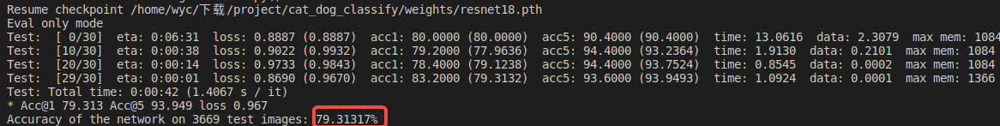
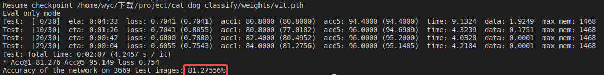
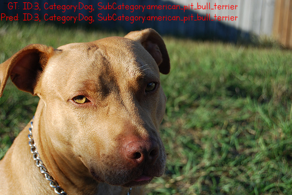

<div align="center">

# 猫狗识别

</div>

## Get Started
### Installation and Run
step 1. Prepare Environment
```bash
#测试环境
python 3.9.16
torch 1.10
torchvision 0.11.0
timm 1.0.7
```
step 2. Clone the repository
```bash
git clone https://github.com/WangYichen222/cat_dot_classfiy.git
cd cat_dot_classfiy
```
step 3. Run code
```bash
#生成数据集
download dataset:https://www.robots.ox.ac.uk/~vgg/data/pets/
python divide.py #需要更改数据目录和目标目录位置
#训练
MODEL支持resnet18,mobilenet_v3_small,mobilenet_v3_large,vit
python main.py --model {MODEL} ----data_path {DATAPATH} --output_dir {OUTPUTDIR} --epochs 300 --batch_size 128 --lr 4e-3 --use_amp True
#测试
python main.py --model {MODEL} --resume {CHECKPOINT} --eval_data_path {EVALDATAPATH} --use_amp True --eval True
#推理单张图片
python inference.py --model {MODEL} --img_path {IMGPATH} --checkpoint {CHECKPOINT} --use_amp True
```
### Result Show
(1)Test Accuracy\
a.resnet18

b.vit

(2)Inference Result Show
